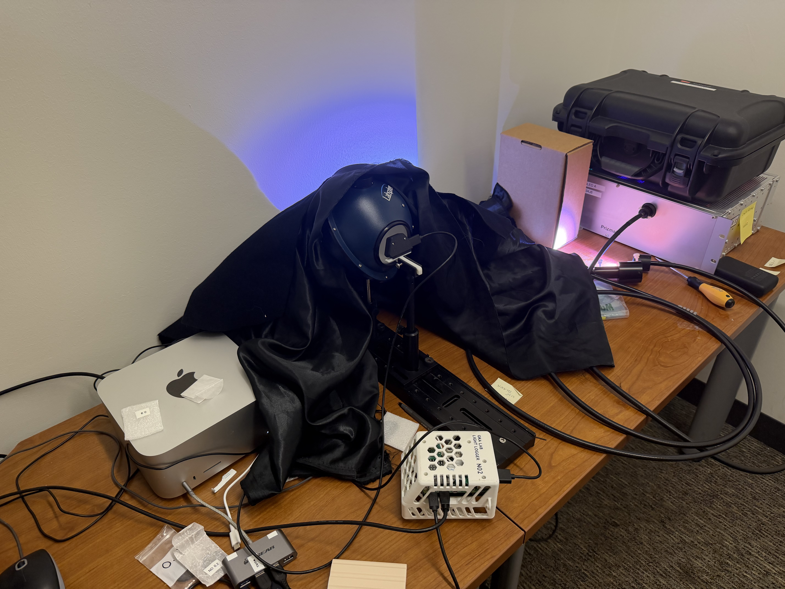
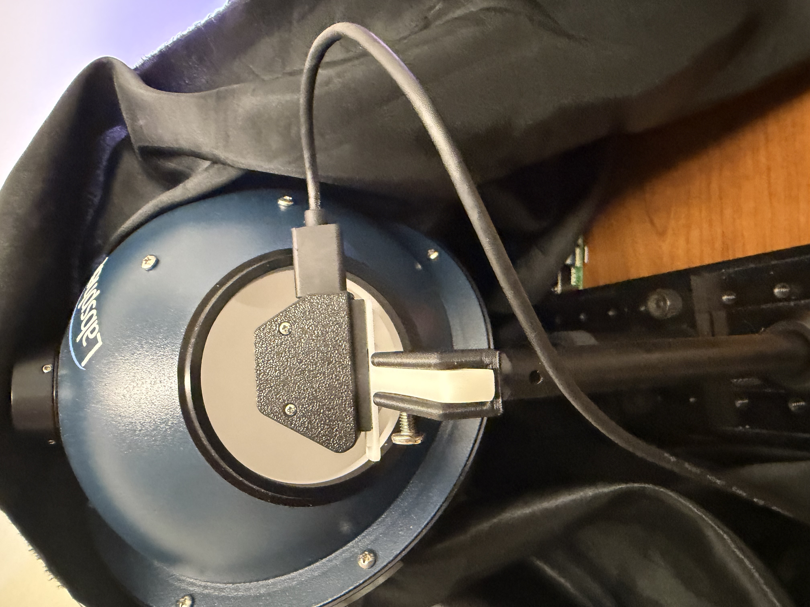
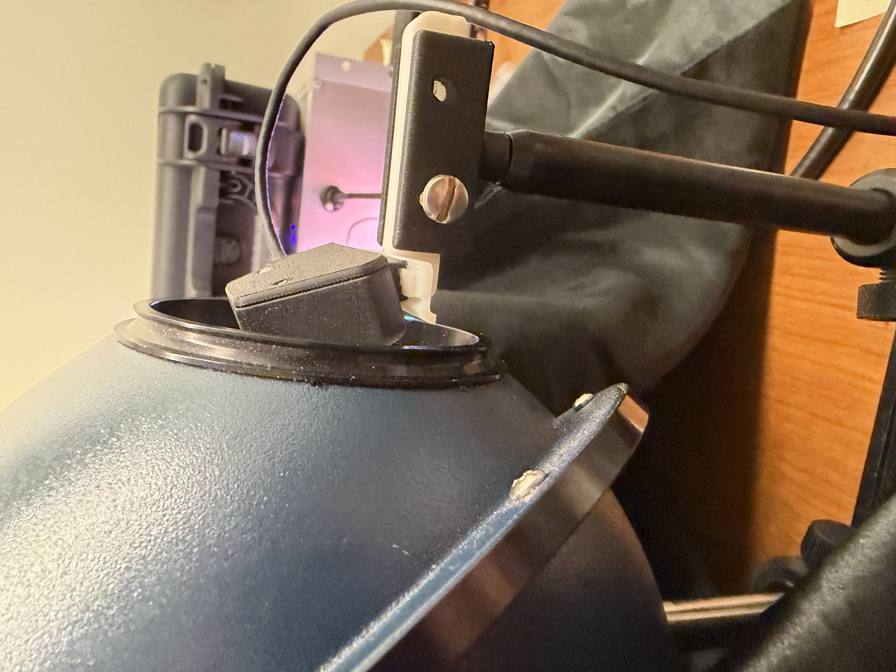
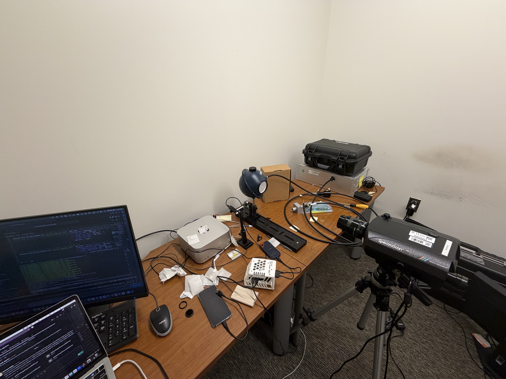

# AGC Settings by Neutral-Density Filter Level

## Overview

The goal of this calibration was to characterize the world camera's automatic gain control (AGC) settings under a controlled range of lighting conditions. Neutral-density filters (NDFs) were used to change the amount of light reaching the measurement instruments while the CombiLED provided a repeatable source. The calibration was performed in two stages:

1. Record the Light Logger's world camera and its other sensors while the camera was positioned inside the integrating sphere.
2. Repeat the NDF sequence with a PR-670 spectroradiometer to obtain a radiometric reference measurement for each lighting condition.

The world-camera and PR-670 results are stored separately under `worldCamera/` and `PR670/`, respectively.

> **NDF 4 configuration:** A single NDF 4 filter was not available, so NDF 4 was produced by combining the NDF 1 and NDF 3 filters.

> **IR-filter configuration:** The IR filter was not applied during this calibration.

## Equipment

| Component | Role in the measurement |
| --- | --- |
| Light integrating sphere | Produced a spatially uniform field for the camera and PR-670 measurements. |
| CombiLED | Illuminated the sphere using a contrast setting of `0.5`. |
| Light Logger pack and world camera | Recorded the world-camera images, AGC metadata, and the other synchronized Light Logger sensor streams. |
| Android phone | Controlled and monitored the Light Logger recordings. |
| Neutral-density filters | Produced NDF conditions 0 through 4; NDF 4 was assembled from NDF 1 and NDF 3. |
| PR-670 spectroradiometer | Measured the sphere output during the second stage of the calibration. |

## Stage 1: World-Camera Measurements

The world camera was positioned at the integrating sphere port so that it viewed the illuminated interior of the sphere. The Light Logger pack and Android phone were connected and configured to record all Light Logger sensors. The CombiLED was set to a contrast of `0.5`.

For each NDF level from 0 through 4, the applicable filter configuration was installed and a new Light Logger recording was collected. During every recording:

- the world camera remained immersed in the integrating sphere;
- the CombiLED emitted the `0.5`-contrast stimulus;
- all unnecessary room lights were turned off; and
- the integrating sphere and camera interface were covered with two layers of black cloth to minimize stray light.

### World-camera setup photographs



*Figure 1. Complete world-camera measurement setup. The integrating sphere and camera interface were covered with black cloth during acquisition to suppress stray light.*



*Figure 2. Front view of the world camera positioned at the integrating-sphere port.*



*Figure 3. Side view of the world-camera mount and its alignment with the sphere opening.*

## Stage 2: PR-670 Measurements

After completing the Light Logger recordings, the same NDF sequence was repeated with the PR-670 spectroradiometer. For each NDF condition, the sphere output was measured by running `measureUncontrolledSourceSpectrum.m`.

For the PR-670 measurements, all unnecessary room lights were turned off to limit ambient-light contamination. The two-layer cloth shroud used for the world-camera recordings was not required for this stage.



*Figure 4. PR-670 measurement setup. The spectroradiometer was aligned with the integrating sphere while the computer controlled acquisition.*

## Data Organization

```text
AGCSettingsByNDF/
├── PR670/
└── worldCamera/
    ├── NDF0/
    ├── NDF1/
    ├── NDF2/
    ├── NDF3/
    └── NDF4/
```

The `worldCamera/NDF0/` through `worldCamera/NDF4/` directories will each contain three synchronized MAT files generated by `populateData.ipynb`. Each file contains the unprocessed Bayer frame, the camera's AGC settings, the world-camera timestamp, and the nearest minispect measurement.

## Selected World-Camera Frames

The zero-based global raw-frame indices below count only frames physically present in the raw chunks; synthetic rows inserted for timestamp gaps are excluded. Run `selectAGCSettingsByNDFFrames.ipynb` to count the physical frames, select frames at approximately two seconds before the end, one second before the end, and the final frame of each recording, and replace this table automatically. A row containing only `0` values is still a placeholder.

<!-- populateData:agc-settings-by-ndf-frame-indices:start -->
| NDF level | Frame 1 | Frame 2 | Frame 3 |
| ---: | ---: | ---: | ---: |
| 0 | 8323 | 8443 | 8563 |
| 1 | 10149 | 10269 | 10389 |
| 2 | 10996 | 11116 | 11236 |
| 3 | 8607 | 8727 | 8847 |
| 4 | 8242 | 8362 | 8482 |
<!-- populateData:agc-settings-by-ndf-frame-indices:end -->
