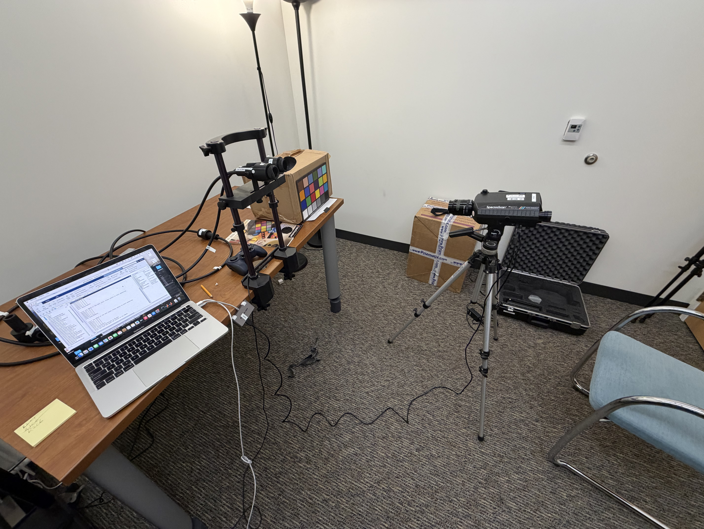
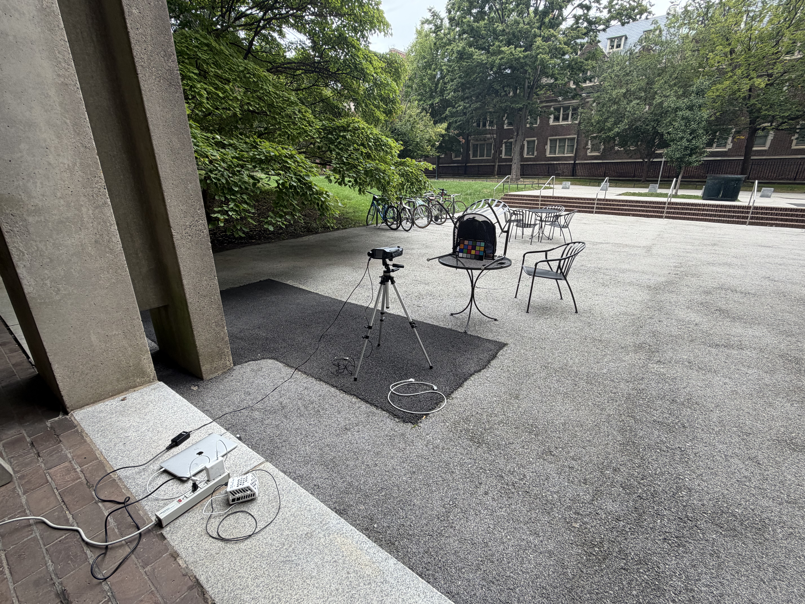
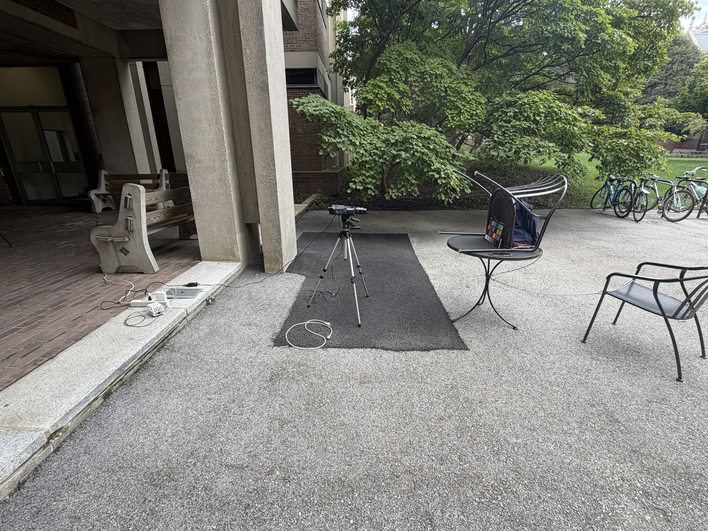
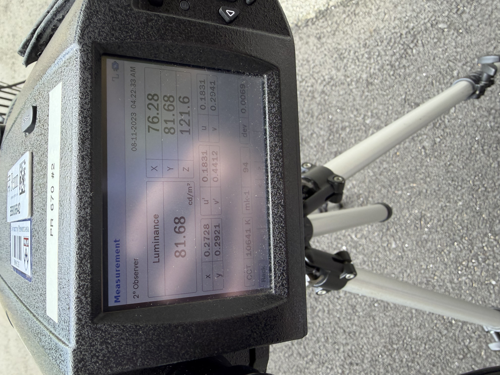

# Camera Chromatic Verification Measurement

## Overview

These measurements were performed indoors in the **Flicker Room** and outdoors outside **Goddard Hall** to verify the chromatic response of the Light Logger camera against a Macbeth ColorChecker, using a PR-670 spectroradiometer as the reference instrument.

## Equipment

| Item | Details |
| --- | --- |
| Spectroradiometer | Photo Research PR-670, unit #2 |
| Color target | Macbeth ColorChecker Color Rendition Chart, standard 24-patch format, March 1996 edition |
| Camera | Light Logger N02, camera set 2 |

## ColorChecker Identification

The physical target used for this measurement is a **March 1996 edition** of the standard Macbeth ColorChecker Color Rendition Chart. Its relevant identifying details are:

| Attribute | Identification |
| --- | --- |
| Historical product name | Macbeth ColorChecker Color Rendition Chart |
| Historical product number | `50105` (standard/full-size chart) |
| Edition/manufacturing date | March 1996, as printed on the back of this chart |
| Manufacturer/era | Macbeth / Munsell Color Services Laboratory, during the Kollmorgen era |
| Format | Standard chart; 24 patches arranged in a 4 × 6 grid |
| Approximate dimensions | 8 × 11 7/16 in. (20.4 × 29.0 cm) |
| Color formulation | Original formulation, manufactured before the November 2014 formulation change |

The standard chart was later renamed the ColorChecker Classic and is now identified by part number `MSCCC`. The historical `50105` product number is retained here because it corresponds to this older Macbeth-era standard chart. Because this particular chart predates the November 2014 pigment reformulation, any external reference data used with it should be the **before-November-2014** ColorChecker data. The directly measured PR-670 spectra archived here remain the preferred reference for this physical chart, since its age, storage, and handling may have changed its reflectance from nominal reference values.

Identification references: [BabelColor ColorChecker formats and history](https://babelcolor.com/colorchecker.htm#CCP1_ChartsFormats) and [BabelColor, *RGB Coordinates of the Macbeth ColorChecker*](https://www.rigacci.org/wiki/lib/exe/fetch.php/doc/appunti/software/color_management/rgb_coordinates_of_the_macbeth_colorchecker.pdf).

## Experimental Setup

### Indoor

The Macbeth ColorChecker was positioned upright against a box in the Flicker Room. The PR-670 was placed in front of the chart and aligned with the selected color patches. The Light Logger camera was positioned nearby to capture the same target for comparison.

*Indoor experimental setup in the Flicker Room.*

### Outdoor

The outdoor measurement was performed on a table outside Goddard Hall. An extension cord connected to the wall outlet outside the Goddard breezeway supplied power to the PR-670 and laptop. The Macbeth ColorChecker leaned against a chair placed upside down on the table, with a backpack behind the chair to keep wind from disturbing the setup. The PR-670 was mounted on a tripod in front of the chart and aligned with the selected patches.

*Outdoor experimental setup and power connection near the Goddard breezeway.*

*Side view of the outdoor chart support and PR-670 alignment.*

*Outdoor luminance measurement of R1C3 (Blue Sky, index 3): 81.68 cd/m², as shown on the PR-670 display.*

## Selected ColorChecker Patches

Five patches were selected for measurement. Patch indices, rows, and columns are all **one-indexed**. Index 1 is the upper-left patch, and numbering proceeds left-to-right across each row, then top-to-bottom.

Each lighting condition contains one numerically named directory per measurement. Within each measurement directory, reference spectra are stored in `PR670/` and use the naming pattern `<condition><measurement>_R<row>C<column>.mat`.

| Index | Patch name | Row | Column | PR-670 filename pattern |
| ---: | --- | :---: | :---: | --- |
| 3 | Blue Sky | 1 | 3 | `PR670/<condition><measurement>_R1C3.mat` |
| 6 | Bluish Green | 1 | 6 | `PR670/<condition><measurement>_R1C6.mat` |
| 9 | Moderate Red | 2 | 3 | `PR670/<condition><measurement>_R2C3.mat` |
| 12 | Orange Yellow | 2 | 6 | `PR670/<condition><measurement>_R2C6.mat` |
| 22 | Neutral 5 | 4 | 4 | `PR670/<condition><measurement>_R4C4.mat` |

*Selected ColorChecker patches, marked in red.*

## Procedure

1. Position the Macbeth ColorChecker upright using the indoor or outdoor setup described above.
2. Place the PR-670 in front of the ColorChecker and align it with the target patch.
3. Run `measureUncontrolledSourceSpectrum.m` to acquire **five measurements** from each selected patch.
4. Repeat the measurement sequence for all five patches listed above.
5. Record close views of the chart under both indoor and outdoor lighting with the world camera and MS on the Light Logger.
6. Extract the selected world-camera frame from each recording and pair it with its nearest MS measurement.

## Selected Light Logger Frames

The notebook uses one Dropbox source root, `MacBethColorCheck`. Beneath it, each condition contains numerically named measurement directories, and each measurement contains its raw chunks at `<condition>/<measurement>/MacBethColorCheck_raw/`. Selected frames are written to the matching numbered measurement directory under `data/MacBethColorCheck/`.

The global world-frame indices are zero-based:

| Condition | Measurement | Global world-frame index | Saved file |
| --- | ---: | ---: | --- |
| Indoor | 1 | 32000 | `indoor/1/lightLogger/close_AGCandMS_01.mat` |
| Indoor | 2 | 7666 | `indoor/2/lightLogger/close_AGCandMS_01.mat` |
| Outdoor | 1 | 10333 | `outdoor/1/lightLogger/close_AGCandMS_01.mat` |

`populateData.ipynb` reads the frame selections directly from this table. Each MAT file includes the raw `worldFrame`, `globalWorldFrameIndex`, `worldTimestampSeconds`, `AGCSettings` (analog gain, digital gain, and exposure), and the nearest `minispectTimestampSeconds` and `minispectValue`, along with a descriptive frame label and schema documentation.

The `worldFrame` images in these MAT files contain the original world-camera pixel values. **Absolutely no image processing was applied**, including no digital-gain application, debayering, linearization, fielding correction, RGB correction, floor/ceiling correction, rescaling, or other transformation.

## Objective

The objective of this procedure was to verify the chromatic properties of the Light Logger camera by comparing its response to the known ColorChecker patches and the corresponding PR-670 spectral measurements.

## `ColorChecker_RGB_and_spectra.xls`
Spectral reflectance data for the Macbeth color checker chart, downloaded from https://babelcolor.com/colorchecker.htm

