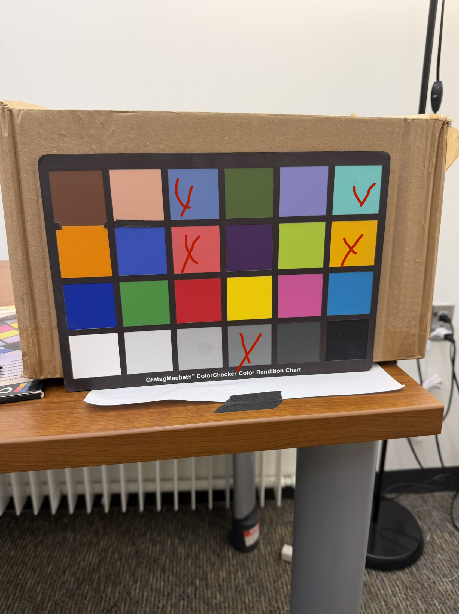

# Camera Chromatic Verification Measurement

## Overview

This measurement was performed in the **Flicker Room** to verify the chromatic response of the Light Logger camera against a Macbeth ColorChecker, using a PR-670 spectroradiometer as the reference instrument.

## Equipment

| Item | Details |
| --- | --- |
| Spectroradiometer | Photo Research PR-670, unit #2 |
| Color target | Macbeth ColorChecker Color Rendition Chart, standard 24-patch format, March 1996 edition |
| Camera | Light Logger N02, camera set 2 |

## ColorChecker Identification

The physical target used for this measurement is a **March 1996 edition** of the standard Macbeth ColorChecker Color Rendition Chart. Its relevant identifying details are:

| Attribute | Identification |
| --- | --- |
| Historical product name | Macbeth ColorChecker Color Rendition Chart |
| Historical product number | `50105` (standard/full-size chart) |
| Edition/manufacturing date | March 1996, as printed on the back of this chart |
| Manufacturer/era | Macbeth / Munsell Color Services Laboratory, during the Kollmorgen era |
| Format | Standard chart; 24 patches arranged in a 4 × 6 grid |
| Approximate dimensions | 8 × 11 7/16 in. (20.4 × 29.0 cm) |
| Color formulation | Original formulation, manufactured before the November 2014 formulation change |

The standard chart was later renamed the ColorChecker Classic and is now identified by part number `MSCCC`. The historical `50105` product number is retained here because it corresponds to this older Macbeth-era standard chart. Because this particular chart predates the November 2014 pigment reformulation, any external reference data used with it should be the **before-November-2014** ColorChecker data. The directly measured PR-670 spectra archived here remain the preferred reference for this physical chart, since its age, storage, and handling may have changed its reflectance from nominal reference values.

Identification references: [BabelColor ColorChecker formats and history](https://babelcolor.com/colorchecker.htm#CCP1_ChartsFormats) and [BabelColor, *RGB Coordinates of the Macbeth ColorChecker*](https://www.rigacci.org/wiki/lib/exe/fetch.php/doc/appunti/software/color_management/rgb_coordinates_of_the_macbeth_colorchecker.pdf).

## Experimental Setup

The Macbeth ColorChecker was positioned upright against a box in the Flicker Room. The PR-670 was placed in front of the chart and aligned with the selected color patches. The Light Logger camera was positioned nearby to capture the same target for comparison.

*Figure 1. Experimental setup in the Flicker Room.*

## Selected ColorChecker Patches

Five patches were selected for measurement. Patch indices, rows, and columns are all **one-indexed**. Index 1 is the upper-left patch, and numbering proceeds left-to-right across each row, then top-to-bottom.

| Index | Patch name | Row | Column | PR-670 file |
| ---: | --- | :---: | :---: | --- |
| 3 | Blue Sky | 1 | 3 | `PR670/Index-03_BlueSky_radianceSpectrum.mat` |
| 6 | Bluish Green | 1 | 6 | `PR670/Index-06_BlueishGreen_radianceSpectrum.mat` |
| 9 | Moderate Red | 2 | 3 | `PR670/Index-09_ModerateRed_radianceSpectrum.mat` |
| 12 | Orange Yellow | 2 | 6 | `PR670/Index-12_OrangeYellow_radianceSpectrum.mat` |
| 22 | Neutral 5 | 4 | 4 | `PR670/Index-22_Neutral5_radianceSpectrum.mat` |

*Figure 2. Selected ColorChecker patches, marked in red.*

## Procedure

1. Position the Macbeth ColorChecker upright in the Flicker Room, supported by a box.
2. Place the PR-670 in front of the ColorChecker and align it with the target patch.
3. Run `measureUncontrolledSourceSpectrum.m` to acquire **five measurements** from each selected patch.
4. Repeat the measurement sequence for all five patches listed above.
5. Record the indoor-close view with the world camera and MS on the Light Logger.
6. Extract the selected world-camera frame listed below and pair it with its nearest MS measurement.

## Selected Light Logger Frames

The global world-frame indices are zero-based:

| View | Global world-frame index | Saved file |
| --- | ---: | --- |
| Indoor close | 32000 | `lightLogger/indoor_close_AGCandMS_01.mat` |

The `worldFrame` image in this MAT file contains the original world-camera pixel values. **Absolutely no image processing was applied**, including no digital-gain application, debayering, linearization, fielding correction, RGB correction, floor/ceiling correction, rescaling, or other transformation.

## Objective

The objective of this procedure was to verify the chromatic properties of the Light Logger camera by comparing its response to the known ColorChecker patches and the corresponding PR-670 spectral measurements.
